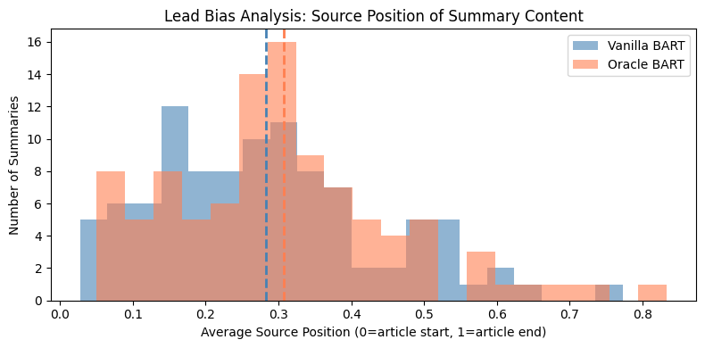

# Oracle-Guided BART for Abstractive Text Summarization

<div align="center">


### Reducing Lead Bias in Neural Summarization using Oracle Sentence Guidance

</div>

---

# Overview

This project explores the evolution of **abstractive text summarization** architectures — from classical **Seq2Seq LSTM with Bahdanau Attention** to modern **Transformer-based BART**, and finally proposes a novel **Oracle-Guided BART** framework to mitigate **lead bias** and improve semantic content selection.

The project was implemented and evaluated on the **CNN/DailyMail** summarization dataset.

Unlike standard summarization systems that often over-focus on the beginning of articles, our approach guides the model toward semantically important content by prepending automatically selected oracle sentences before the full article.

---

# Key Contributions

* Implemented a complete **BiLSTM + Bahdanau Attention** summarization baseline from scratch.
* Fine-tuned **facebook/bart-large-cnn** for abstractive summarization.
* Proposed a lightweight **Oracle-Guided BART** architecture.
* Conducted detailed evaluation using:

  * ROUGE metrics
  * Lead Bias Analysis
  * Abstractiveness Analysis
  * Qualitative Comparison
* Demonstrated how oracle guidance shifts summaries toward deeper article regions.

---

# Problem Statement

Modern summarization models, especially on news datasets like CNN/DailyMail, suffer from **lead bias**.

Since important information is frequently placed in the first few sentences of news articles, models learn a shortcut:

> “Focus mainly on the beginning of the article.”

This becomes problematic for:

* Long-form documents
* Legal reports
* Medical records
* Research papers
* Investigative journalism

where important information may appear much later.

This project investigates whether **oracle-guided prefix conditioning** can reduce this bias.

---

# Architectures Implemented

## 1. Seq2Seq BiLSTM + Bahdanau Attention

### Pipeline

Article Tokens → Embeddings → BiLSTM Encoder → Bahdanau Attention Decoder → Summary

### Features

* Bidirectional LSTM encoder
* Attention-based decoder
* Teacher forcing training
* Greedy decoding inference
* Custom vocabulary construction

### Motivation

Used as a classical neural summarization baseline to understand limitations of recurrent architectures.

---

## 2. Vanilla BART

### Model

`facebook/bart-large-cnn`

### Why BART?

BART combines:

* Bidirectional encoder (BERT-like)
* Autoregressive decoder (GPT-like)
* Transformer self-attention
* Large-scale denoising pretraining

This makes it highly effective for abstractive summarization.

---

## 3. Oracle-Guided BART (Proposed Method)

### Core Idea

Before feeding the article to BART, prepend 3 important oracle sentences.

### Input Format

```text
[Oracle Sentence 1]
[Oracle Sentence 2]
[Oracle Sentence 3]
</s>
[Full Article]
```

These oracle sentences act as guidance signals that bias the encoder toward salient content.

---

# Oracle Sentence Extraction

## Training Time Oracle

During training, gold summaries are available.

We use:

* Greedy ROUGE-2 maximization

to iteratively select the top 3 source sentences most aligned with the reference summary.

---

## Inference Time Oracle

During testing, gold summaries are unavailable.

Therefore, we approximate salient content using:

* TF-IDF sentence vectors
* Cosine similarity ranking

Top 3 ranked sentences are used as pseudo-oracle guidance.

---

# Dataset

## CNN/DailyMail

Widely used benchmark dataset for abstractive summarization.

### Dataset Characteristics

* News articles + human summaries
* Strong lead bias present
* Long-form article structure

### Experimental Subset

Due to compute constraints:

* 5000 training samples
* 500 validation samples
* 500 test samples

---

# Evaluation Metrics

## 1. ROUGE Scores

Standard summarization evaluation metrics:

* ROUGE-1
* ROUGE-2
* ROUGE-L

---

## 2. Lead Bias Analysis

We measure:

> Which article positions contribute most to generated summaries?

Lower values indicate stronger dependence on article beginnings.

---

## 3. Abstractiveness Analysis

We compute novelty score:

```math
Novelty = 1 - ROUGE-1 Precision(summary, source)
```

Higher novelty indicates more abstractive generation.

---

# Results

| Model            | ROUGE-1        | ROUGE-2        | ROUGE-L        |
| ---------------- | -------------- | -------------- | -------------- |
| LSTM + Attention | 0.1010         | 0.0095         | 0.0822         |
| Vanilla BART     | 0.3509         | 0.1470         | 0.2511         |
| Oracle BART      | **0.3573**     | **0.1498**     | **0.2563**     |

---

# Lead Bias Results

| Model        | Avg Source Position |
| ------------ | ------------------- |
| Vanilla BART | 0.283               |
| Oracle BART  | **0.307**           |

### Interpretation

Oracle-guided BART draws information from deeper article regions instead of relying heavily on opening sentences.



---

# Abstractiveness Results

| Model        | Novelty Score |
| ------------ | ------------- |
| Vanilla BART | 0.037         |
| Oracle BART  | **0.045**     |

### Observation

Oracle guidance improves paraphrasing behavior and reduces direct copying.

---

# Repository Structure

```bash
.
├── notebooks/
│   ├── LSTM_Training.ipynb
│   ├── BART_Training.ipynb
│   ├── Oracle_Bart.ipynb
│   ├── Qualitative_Analysis.ipynb
│
├── presentation/
│   ├── Qualitative_Examples.pdf
│   └── NLP_Presentation.pdf
│
├── results/
│   ├── abstractive_analysis_results.png
│   ├── lead_bias_analysis.png
│   ├── lead_bias_results.png
│   └── rouge_results_comparison.png
│
└── README.md
```

---

# Technologies Used

* Python
* PyTorch
* HuggingFace Transformers
* NLTK
* Scikit-learn
* ROUGE
* Matplotlib
* CNN/DailyMail Dataset

---

# Installation

## Clone Repository

```bash
git clone https://github.com/YOUR_USERNAME/oracle-guided-bart-summarization.git
cd oracle-guided-bart-summarization
```

---

## Create Virtual Environment

```bash
python -m venv venv
source venv/bin/activate
```

For Windows:

```bash
venv\Scripts\activate
```

---

## Install Dependencies

```bash
pip install -r requirements.txt
```

---

# Running the Project

## LSTM Baseline

```bash
jupyter notebook notebooks/NLP_LSTM_Training.ipynb
```

## BART Fine-Tuning

```bash
jupyter notebook notebooks/NLP_BART_Training.ipynb
```

## Oracle-Guided BART

```bash
jupyter notebook notebooks/Oracle_Bart.ipynb
```

---

# Research Motivation

This project was inspired by recent work in:

* Neural Machine Translation
* Controlled Text Generation
* Guided Summarization
* Transformer Architectures
* Lead Bias Mitigation

Key references include:

* Bahdanau et al. — Neural Machine Translation by Jointly Learning to Align and Translate
* Lewis et al. — BART: Denoising Sequence-to-Sequence Pre-training
* Dou et al. — GSum: A General Framework for Guided Neural Abstractive Summarization

---

# Future Work

Potential extensions:

* BERTScore-based oracle extraction
* Semantic sentence ranking
* Long-document transformers
* Factuality-aware decoding
* Human evaluation studies
* Domain transfer to legal/medical summarization

---

# Key Takeaways

* Attention improves Seq2Seq summarization significantly.
* Transformers outperform recurrent architectures on long documents.
* Lead bias remains a major issue in summarization datasets.
* Lightweight oracle guidance can improve positional diversity and abstractiveness.
* Better summarization evaluation requires more than ROUGE alone.

---

# Authors

Keshav Laddha
B.Tech CSE, The LNM Institute of Information Technology

---

# Acknowledgements

We sincerely thank our project guide and the open-source NLP research community for their valuable contributions.

---

# License

This project is intended for academic and research purposes.
